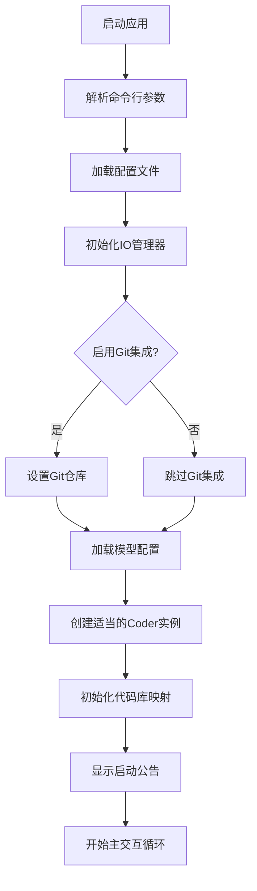
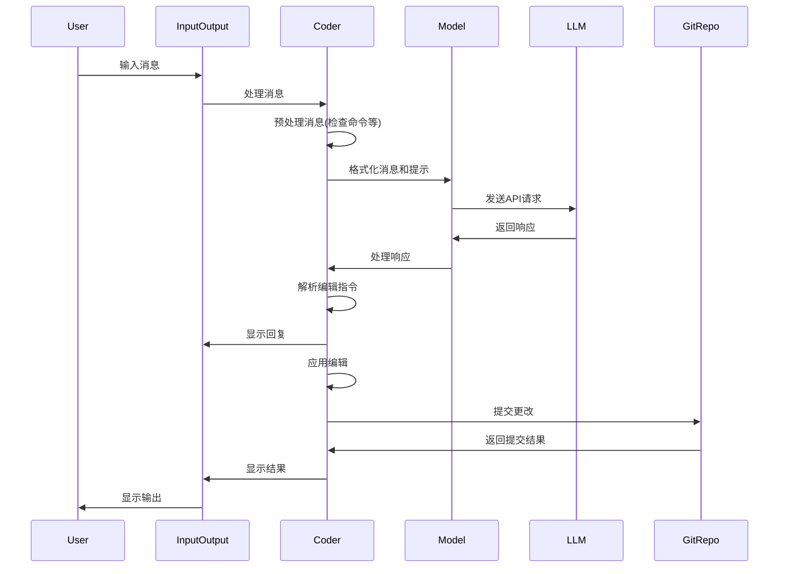
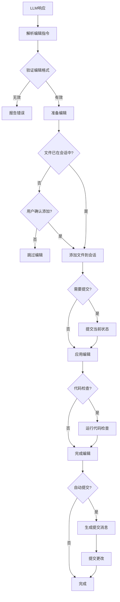

# Aider 架构文档

## 文档目的

本文档详细描述了Aider项目的架构设计、核心组件、数据流以及技术决策。目标读者包括项目开发者、贡献者以及希望理解Aider内部工作机制的用户。

## 1. 架构概述

Aider是一个终端应用程序，允许用户与大型语言模型(LLM)进行结对编程。其核心功能包括：
- 与多种LLM提供商的API集成
- 代码编辑和生成
- Git版本控制集成
- 智能代码库上下文管理

### 1.1 系统上下文图

```
┌─────────────────────────────────────────────────────────────────┐
│                      外部环境/依赖                              │
│                                                                 │
│  ┌───────────┐     ┌───────────┐     ┌───────────────────────┐  │
│  │  LLM API  │     │ 文件系统  │     │      Git 仓库         │  │
│  │ (OpenAI,  │     │           │     │                       │  │
│  │ Anthropic)│     │           │     │                       │  │
│  └───────────┘     └───────────┘     └───────────────────────┘  │
└─────────────────────────────────────────────────────────────────┘
                            │
                            │
                            ▼
┌─────────────────────────────────────────────────────────────────┐
│                           Aider                                 │
│                                                                 │
│  ┌───────────┐     ┌───────────┐     ┌───────────────────────┐  │
│  │  模型管理 │     │ 代码生成器│     │    Git 集成           │  │
│  │ (models.py)│◄───►(coders/*.py)◄───►   (repo.py)           │  │
│  └───────────┘     └───────────┘     └───────────────────────┘  │
│         ▲                ▲                     ▲                │
│         │                │                     │                │
│         ▼                ▼                     ▼                │
│  ┌───────────┐     ┌───────────┐     ┌───────────────────────┐  │
│  │ 输入/输出 │     │  命令处理 │     │   代码库映射          │  │
│  │  (io.py)  │◄───►(commands.py)│◄───►  (repomap.py)         │  │
│  └───────────┘     └───────────┘     └───────────────────────┘  │
│                                                                 │
└─────────────────────────────────────────────────────────────────┘
                            │
                            │
                            ▼
┌─────────────────────────────────────────────────────────────────┐
│                         用户界面                                │
│                                                                 │
│  ┌───────────┐     ┌───────────┐     ┌───────────────────────┐  │
│  │ 终端接口  │     │  GUI 接口 │     │     浏览器集成        │  │
│  │           │     │(可选)     │     │    (可选)             │  │
│  └───────────┘     └───────────┘     └───────────────────────┘  │
│                                                                 │
└─────────────────────────────────────────────────────────────────┘
```

### 1.2 架构原则

Aider的架构设计遵循以下原则：

1. **模块化设计**: 将功能划分为独立的模块，使系统易于理解和维护
2. **可扩展性**: 支持添加新的模型、编辑格式和命令
3. **灵活性**: 适应不同的编程场景和工作流程
4. **易用性**: 提供简单直观的用户界面和命令
5. **性能优化**: 通过缓存、摘要等技术减少延迟和令牌使用

## 2. 核心组件

### 2.1 入口点 (main.py)

`main.py` 是应用程序的主入口点，负责：
- 解析命令行参数和配置文件
- 加载环境变量和API密钥
- 初始化核心组件（模型、代码生成器、Git集成等）
- 启动主交互循环

关键功能：
- `main()`: 主函数，处理命令行参数和启动应用程序
- `parse_args()`: 解析命令行参数和配置文件
- `register_models()`: 加载模型配置
- `setup_git()`: 初始化Git集成

### 2.2 模型管理 (models.py)

`models.py` 负责管理与LLM的交互，包括：
- 定义模型设置和元数据
- 管理模型配置和API连接
- 处理模型请求和响应

主要类和函数：
- `ModelSettings`: 数据类，定义模型配置参数
- `Model`: 主要类，封装模型功能和特性
- `ModelInfoManager`: 管理模型元数据信息
- `register_models()`: 从配置文件加载模型设置

代码示例：
```python
@dataclass
class ModelSettings:
    # Model class needs to have each of these as well
    name: str
    edit_format: str = "whole"
    weak_model_name: Optional[str] = None
    # ... 其他配置参数

class Model(ModelSettings):
    def __init__(self, model, weak_model=None, editor_model=None, 
                 editor_edit_format=None, verbose=False):
        # ... 初始化代码
        
    def send_completion(self, messages, functions, stream, temperature=None):
        # ... 发送请求到LLM
```

### 2.3 代码生成器 (coders/)

`coders/` 目录包含多个实现不同编辑格式的代码生成器类：

| 类名 | 文件 | 描述 |
|------|------|------|
| `Coder` | `base_coder.py` | 基础类，处理与LLM的交互和文件管理 |
| `WholeFileCoder` | `wholefile_coder.py` | 整个文件替换格式 |
| `EditBlockCoder` | `editblock_coder.py` | 代码块编辑格式 |
| `UnifiedDiffCoder` | `udiff_coder.py` | 统一差异格式 |
| `ArchitectCoder` | `architect_coder.py` | 架构设计模式 |

工厂方法 `Coder.create()` 根据配置和上下文创建适当的Coder实例。

主要职责：
- 格式化消息和提示
- 解析LLM响应中的编辑指令
- 应用编辑到文件系统
- 管理聊天上下文和历史记录

代码示例：
```python
class EditBlockCoder(Coder):
    edit_format = "editblock"
    
    def get_edits(self, mode="update"):
        edits = []
        blocks = self.find_blocks(self.partial_response_content)
        for block in blocks:
            # 处理编辑块...
            edits.append((path, content))
        return edits
    
    def apply_edits(self, edits):
        for path, content in edits:
            # 应用编辑到文件...
```

### 2.4 Git集成 (repo.py)

`repo.py` 提供与Git版本控制系统的集成：
- 管理Git仓库状态
- 自动提交更改
- 生成提交消息
- 处理文件跟踪和忽略

主要类和函数：
- `GitRepo`: 主要类，封装所有Git操作
- `commit()`: 提交更改并生成提交消息
- `get_diffs()`: 获取文件差异
- `get_tracked_files()`: 获取仓库中跟踪的文件

代码示例：
```python
class GitRepo:
    def __init__(self, io, fnames, git_dname, aider_ignore_file=None, 
                 models=None, ...):
        # ... 初始化代码
    
    def commit(self, fnames=None, context=None, message=None, 
               aider_edits=False, coder=None):
        # ... 提交更改到Git仓库
    
    def get_commit_message(self, diffs, context, user_language=None):
        # ... 生成提交消息
```

### 2.5 输入/输出处理 (io.py)

`io.py` 管理用户交互和界面显示：
- 处理用户输入和输出
- 管理终端颜色和格式
- 提供交互式确认和提示
- 记录历史记录和日志

主要类和函数：
- `InputOutput`: 主要类，处理所有IO操作
- `get_input()`: 获取用户输入
- `tool_output()`, `tool_error()`: 显示工具输出和错误
- `confirm_ask()`: 交互式确认提示

### 2.6 命令系统 (commands.py)

`commands.py` 实现内置命令处理：
- 定义可用命令（如 `/help`, `/add`, `/drop` 等）
- 解析和执行命令
- 提供命令帮助和文档

主要类和函数：
- `Commands`: 主要类，管理所有可用命令
- `run()`: 解析和执行命令
- `is_command()`: 检查输入是否为命令
- 各种命令处理函数（`cmd_help()`, `cmd_add()` 等）

### 2.7 代码库映射 (repomap.py)

`repomap.py` 创建和管理代码库的高级视图：
- 分析代码库结构和内容
- 提供相关上下文给LLM
- 优化令牌使用和相关性

主要类和函数：
- `RepoMap`: 主要类，构建和维护代码库映射
- `get_repo_map()`: 生成代码库的上下文表示
- `find_relevant_files()`: 确定与查询相关的文件

## 3. 数据流与工作流程

### 3.1 启动流程



### 3.2 消息处理流程



### 3.3 编辑应用流程



## 4. 技术决策

### 4.1 编辑格式选择

Aider支持多种编辑格式，各有优缺点：

| 编辑格式 | 优点 | 缺点 | 最佳使用场景 |
|---------|------|------|------------|
| wholefile | 简单，完全控制 | 令牌使用高，不适合大文件 | 小文件，完全重写 |
| editblock | 直观，易于理解 | 可能导致解析错误 | 中型文件，局部编辑 |
| diff/udiff | 精确，令牌高效 | 复杂，难以手动编写 | 大型文件，多处编辑 |
| editor-* | 适合复制粘贴模式 | 需要额外的UI交互 | Web界面集成 |

### 4.2 模型选择

Aider支持多种LLM，选择标准包括：

1. **能力**: 不同模型在代码理解和生成方面有不同的能力
2. **上下文窗口**: 大上下文窗口允许处理更多代码
3. **编辑格式支持**: 某些模型更适合特定的编辑格式
4. **性能**: 响应时间和成本的平衡
5. **API可用性**: 不同区域和用户的API访问差异

推荐模型配置：
- **一般用途**: GPT-4o 或 Claude 3.5 Sonnet
- **大型代码库**: 具有大上下文窗口的模型，如Claude 3 Opus或GPT-4 Turbo
- **快速原型设计**: DeepSeek Coder, Claude 3.5 Haiku等更快的模型

### 4.3 Git集成设计

Git集成的关键决策：

1. **自动提交**: 默认启用，每次编辑后自动提交
   - 优点: 细粒度的历史记录，容易撤销更改
   - 缺点: 可能导致过多的小提交

2. **提交消息生成**: 使用LLM生成有意义的提交消息
   - 优点: 详细的提交历史，无需手动编写
   - 缺点: 额外的API调用和延迟

3. **归因选项**: 提供多种方式标识AI生成的更改
   - 通过提交者/作者姓名(User Name (aider))
   - 通过Co-authored-by提交消息预告片
   - 提交消息前缀

### 4.4 上下文管理策略

为了有效管理令牌使用并提供足够的上下文：

1. **聊天历史摘要**: 使用LLM摘要长会话以减少令牌使用
2. **代码库映射**: 提供代码库的高级概览，而不是所有文件
3. **相关性检测**: 基于当前查询确定最相关的文件
4. **令牌预算分配**: 在不同上下文组件之间智能分配令牌

## 5. 扩展点

### 5.1 添加新模型

要添加新的LLM支持：

1. 修改`models.py`中的`MODEL_SETTINGS`列表
2. 为新模型创建`ModelSettings`条目
3. 如果需要，在`model-metadata.json`中添加模型元数据
4. 更新`MODEL_ALIASES`字典(可选)

例如：
```python
ModelSettings(
    name="new-provider/model-name",
    edit_format="diff",
    use_repo_map=True,
    streaming=True,
)
```

### 5.2 创建新的编辑格式

要添加新的编辑格式：

1. 在`coders/`目录中创建新的Coder子类
2. 实现`get_edits()`和`apply_edits()`方法
3. 设置`edit_format`类属性
4. 在`coders/__init__.py`中注册新的Coder类

示例代码框架：
```python
class NewFormatCoder(Coder):
    edit_format = "new-format"
    
    def get_edits(self, mode="update"):
        # 解析编辑指令...
        return edits
    
    def apply_edits(self, edits):
        # 应用编辑到文件...
```

### 5.3 添加新命令

要添加新的命令：

1. 在`commands.py`的`Commands`类中添加新的方法
2. 命名格式为`cmd_命令名()`
3. 更新帮助文档
4. 实现命令逻辑

示例：
```python
def cmd_new_command(self, arg1=None, arg2=None):
    """
    /new_command [arg1] [arg2] - 这个命令的描述
    """
    # 命令实现...
    return "命令结果"
```

## 6. 性能考虑

### 6.1 令牌优化

减少令牌使用的策略：

1. **选择性文件包含**: 只包含相关文件
2. **代码库映射**: 使用高级映射而不是完整代码
3. **历史摘要**: 摘要长对话历史
4. **差异编辑格式**: 使用更令牌高效的编辑格式

### 6.2 延迟优化

减少感知延迟的策略：

1. **流式响应**: 使用流式API调用显示增量响应
2. **提示缓存**: 缓存提示以减少后续请求时间
3. **并行化**: 并行执行某些操作(如Git操作和代码检查)
4. **弱模型回退**: 对于非关键任务使用更快的模型

## 7. 安全和隐私

### 7.1 数据处理

Aider的数据处理考虑：

1. **本地执行**: 所有代码处理在本地执行，只有必要的上下文发送到LLM
2. **可选分析**: 用户可以选择退出匿名使用数据收集
3. **API密钥管理**: 支持多种API密钥存储方法(环境变量、配置文件等)
4. **敏感文件排除**: 通过.gitignore和.aiderignore排除敏感文件

### 7.2 身份验证

支持多种身份验证方法：

1. **API密钥**: 直接API密钥身份验证
2. **OAuth流程**: 对某些提供商的OAuth支持
3. **环境变量**: 从环境变量加载凭据
4. **配置文件**: 从.env和其他配置文件加载

## 8. 未来发展方向

### 8.1 潜在增强

1. **多模型协作**: 使用多个模型协作解决复杂问题
2. **长期记忆**: 跨会话持久化上下文和理解
3. **插件系统**: 为第三方扩展提供正式的插件API
4. **增强的测试集成**: 与各种测试框架的更深入集成
5. **自定义提示模板**: 用户可定制的提示模板

### 8.2 技术债务和限制

当前架构的限制：

1. **上下文窗口限制**: 即使使用大上下文模型，仍有上下文窗口限制
2. **编辑解析错误**: 某些编辑格式容易出现解析错误
3. **Git集成复杂性**: Git错误处理可能更强健
4. **跨平台兼容性**: 某些功能在不同操作系统上表现不一致

## 附录

### A. 配置选项

Aider支持多种配置选项，可通过命令行参数、配置文件或环境变量设置：

| 配置项 | 描述 | 默认值 |
|-------|------|-------|
| `--model` | 指定使用的LLM | gpt-4o |
| `--edit-format` | 设置编辑格式 | 根据模型默认 |
| `--map-tokens` | 设置代码库映射的令牌预算 | 1024 |
| `--auto-commits` | 启用/禁用自动提交 | 启用 |
| `--git` | 启用/禁用Git集成 | 启用 |

### B. 命令参考

Aider提供多种内置命令：

| 命令 | 描述 |
|-----|------|
| `/help` | 显示帮助信息 |
| `/add [file]` | 添加文件到会话 |
| `/drop [file]` | 从会话中移除文件 |
| `/commit [message]` | 提交当前更改 |
| `/diff` | 显示当前更改的差异 |
| `/undo` | 撤销最后一次提交 |

### C. 编辑格式详细规范

参见文档: [edit_formats.md](../usage/edit_formats.md)

---

*本文档由Aider团队维护。最后更新: 2025/8/22*
