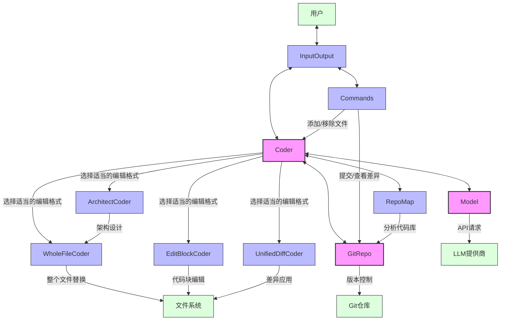
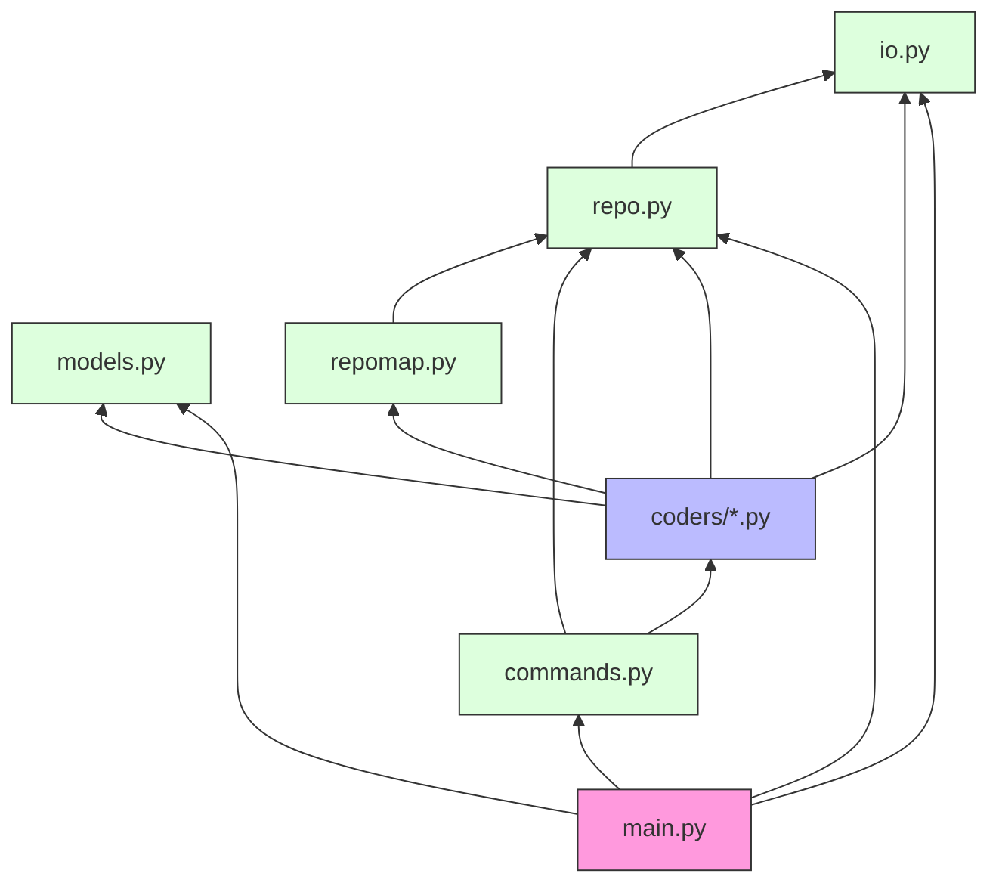

# Aider 组件图

以下Mermaid图表展示了Aider的主要组件和它们之间的关系。

## 核心组件关系图

```mermaid
graph TD
    User[用户] <--> IO[InputOutput]
    IO <--> Commands[Commands]
    IO <--> Coder[Coder]
    
    Coder --> |选择适当的编辑格式| WholeFileCoder[WholeFileCoder]
    Coder --> |选择适当的编辑格式| EditBlockCoder[EditBlockCoder]
    Coder --> |选择适当的编辑格式| UnifiedDiffCoder[UnifiedDiffCoder]
    Coder --> |选择适当的编辑格式| ArchitectCoder[ArchitectCoder]
    
    Coder <--> Model[Model]
    Coder <--> GitRepo[GitRepo]
    Coder <--> RepoMap[RepoMap]
    
    Model --> |API请求| LLM[LLM提供商]
    GitRepo --> |版本控制| Git[Git仓库]
    
    WholeFileCoder --> |整个文件替换| FileSystem[文件系统]
    EditBlockCoder --> |代码块编辑| FileSystem
    UnifiedDiffCoder --> |差异应用| FileSystem
    ArchitectCoder --> |架构设计| WholeFileCoder
    
    Commands --> |添加/移除文件| Coder
    Commands --> |提交/查看差异| GitRepo
    
    RepoMap --> |分析代码库| GitRepo
    
    classDef primary fill:#f9f,stroke:#333,stroke-width:2px;
    classDef secondary fill:#bbf,stroke:#333,stroke-width:1px;
    classDef external fill:#dfd,stroke:#333,stroke-width:1px;
    
    class Coder,Model,GitRepo primary;
    class WholeFileCoder,EditBlockCoder,UnifiedDiffCoder,ArchitectCoder,Commands,IO,RepoMap secondary;
    class LLM,Git,FileSystem,User external;
```

## 数据流向图

```mermaid
flowchart LR
    User([用户])
    Input[用户输入]
    Preprocessor[输入预处理]
    Context[上下文构建]
    LLM[LLM请求]
    Response[LLM响应]
    EditParser[编辑解析]
    FileEdit[文件编辑]
    GitCommit[Git提交]
    Output[输出]
    
    User -->|输入消息| Input
    Input -->|原始文本| Preprocessor
    Preprocessor -->|检查命令/文件提及| Context
    Context -->|添加文件/历史/映射| LLM
    LLM -->|生成回复| Response
    Response -->|提取编辑指令| EditParser
    EditParser -->|应用更改| FileEdit
    FileEdit -->|自动提交| GitCommit
    GitCommit -->|提交结果| Output
    Output -->|显示给用户| User
    
    style User fill:#f96,stroke:#333
    style LLM fill:#f96,stroke:#333
    style FileEdit fill:#f96,stroke:#333
    style GitCommit fill:#f96,stroke:#333
```

## 模块依赖图

```mermaid
graph BT
    main[main.py] --> models[models.py]
    main --> repo[repo.py]
    main --> io[io.py]
    main --> commands[commands.py]
    
    coders[coders/*.py] --> models
    coders --> repo
    coders --> io
    
    commands --> coders
    commands --> repo
    
    repo --> io
    
    repomap[repomap.py] --> repo
    coders --> repomap
    
    style main fill:#f9d,stroke:#333
    style coders fill:#bbf,stroke:#333
    style models fill:#dfd,stroke:#333
    style repo fill:#dfd,stroke:#333
    style io fill:#dfd,stroke:#333
    style commands fill:#dfd,stroke:#333
    style repomap fill:#dfd,stroke:#333
```
